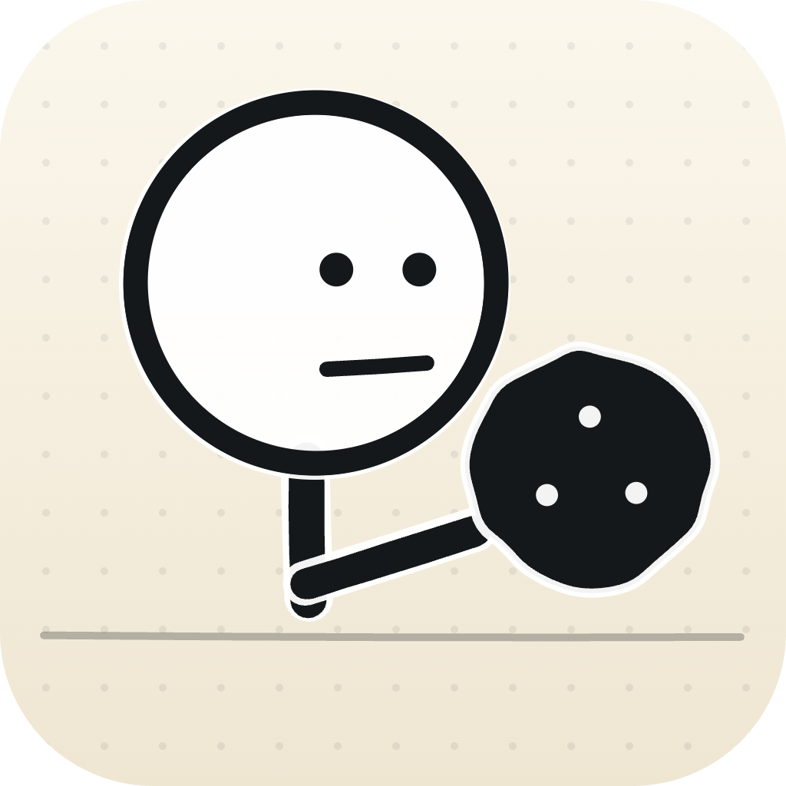
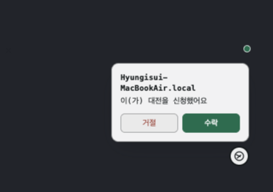
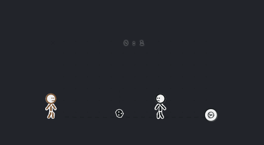
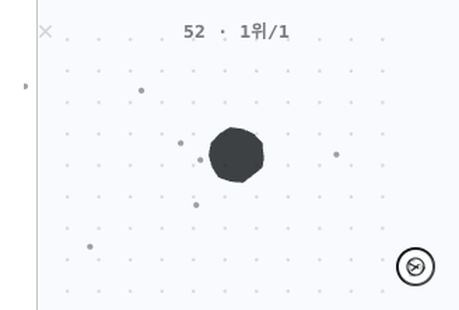

# 오버레이 루팡
### Overlay Lupin

화면 한구석에 숨어 있다가, 옆자리 사람이랑 슬쩍 한 판 붙고 싶을 때만 꺼내 쓰는 미니게임 모음.
같은 Wi-Fi에만 있으면 서버도, 계정도 없이 바로 매칭됩니다.

### [오버레이 루팡 다운로드](https://github.com/yogurt-c/overlay-lupin/releases/latest)

 

&nbsp;&nbsp;
&nbsp;&nbsp;

---

## 뭐가 들어있나요

- **존재감 없는 오버레이** — 다른 창 위에 투명하게 떠 있어서, 일하는 척 하면서 바로 한 판
- **즉석 매칭** — 같은 Wi-Fi에 연결돼 있으면 서버 없이 자동으로 서로를 찾아줌
- **대두축구** — 손그림 스타일 1:1 대전, 5골 먼저 넣으면 승리
- **배구** — 손그림 스타일 1:1 대전, 다이빙으로 받아서 스파이크로 꽂고 5점 먼저 내면 승리
- **세포키우기** — 최대 6명, 방장이 방 열면 누구나 자유롭게 참가·중도 합류. 점을 먹고 커지고, 나보다 작은 세포는 삼키고 큰 세포는 도망 — 끝나는 판 없이 방에 한 명이라도 남아있으면 계속

---

개발/빌드 이야기는 [docs](docs) 폴더에.

