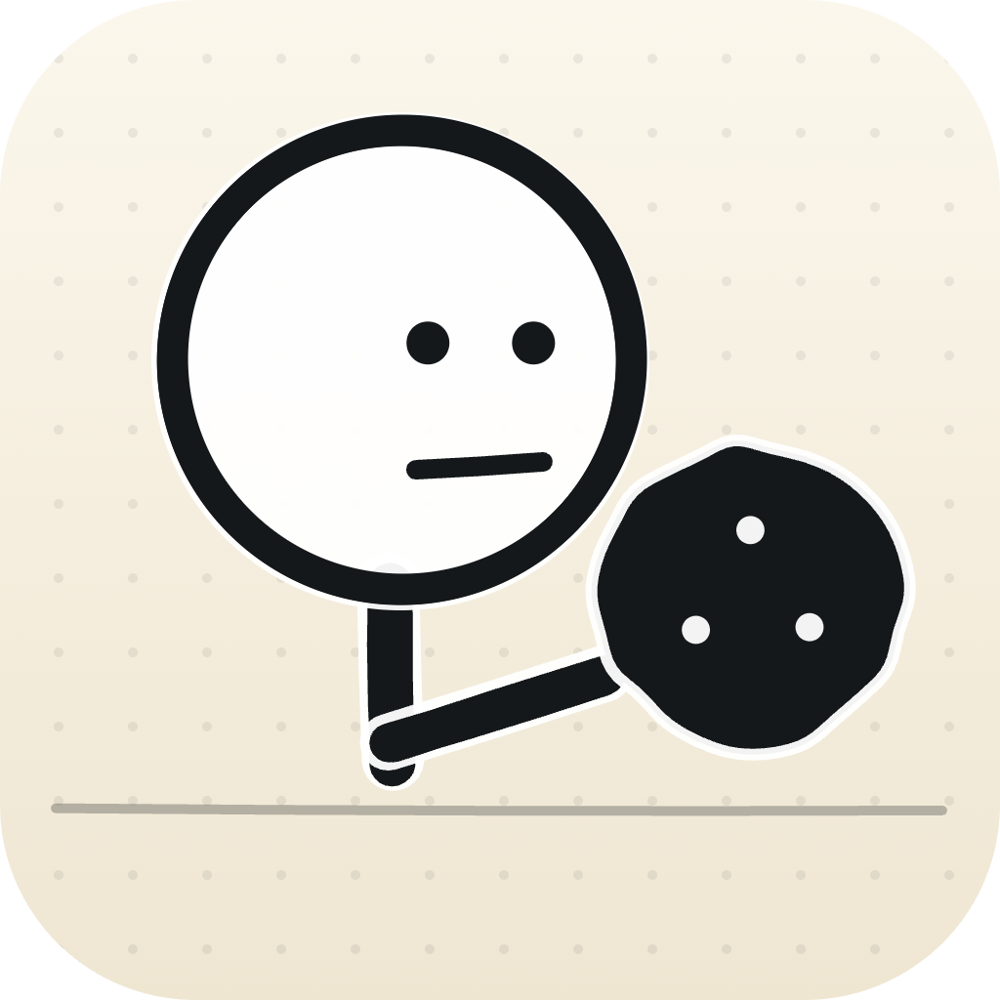
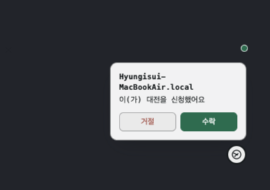
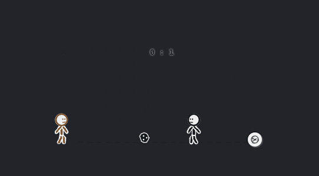
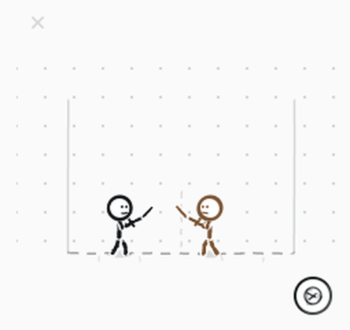
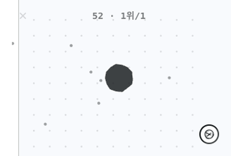

# 오버레이 루팡
### Overlay Lupin

화면 한구석에 숨어 있다가, 옆자리 사람이랑 슬쩍 한 판 붙고 싶을 때만 꺼내 쓰는 미니게임 모음.
같은 Wi-Fi에만 있으면 서버도, 계정도 없이 바로 매칭됩니다.

### [오버레이 루팡 다운로드](https://github.com/yogurt-c/overlay-lupin/releases/latest)

[오버레이 루팡 공식 홈페이지 — 게임 소개와 무료 다운로드](https://yogurt-c.github.io/overlay-lupin/)

 

&nbsp;&nbsp;
&nbsp;&nbsp;
&nbsp;&nbsp;

---

## 뭐가 들어있나요

- **존재감 없는 오버레이** — 다른 창 위에 투명하게 떠 있어서, 일하는 척 하면서 바로 한 판
- **즉석 매칭** — 같은 Wi-Fi에 연결돼 있으면 서버 없이 자동으로 서로를 찾아줌
- **대두축구** — 손그림 스타일 1:1 대전, 5골 먼저 넣으면 승리
- **배구** — 손그림 스타일 1:1 대전, 다이빙으로 받아서 스파이크로 꽂고 5점 먼저 내면 승리
- **칼싸움** — 손그림 스타일 1:1 대전, 상단·하단·찌르기를 상대 가드 반대편으로 넣어서 목숨 5개를 먼저 다 깎으면 승리
- **세포키우기** — 최대 6명, 방장이 방 열면 누구나 자유롭게 참가·중도 합류. 점을 먹고 커지고, 나보다 작은 세포는 삼키고 큰 세포는 도망 — 끝나는 판 없이 방에 한 명이라도 남아있으면 계속
- **동물탑** — 손그림 동물 23종을 회전시켜 쌓는 물리 게임. 혼자하기 봇 대전 또는 사람과 1:1 교대 대전, 매 판 선공 무작위 추첨, 떨어뜨린 사람이 패배
- **점프맵** — 최대 6명, 방장이 방 열면 누구나 자유롭게 참가·중도 합류. 손그림 코스를 타고 올라가 깃발을 가장 먼저 찍으면 1위, 이후 15초 그레이스 타임 동안 나머지 순위 확정. 제한시간도 함정도 없고, 공격키로 상대를 살짝 밀쳐내는 것만 가능 — 판이 끝나면 곧바로 같은 방에서 다음 판 시작
- **뱀서** — 최대 4인 협동 생존, 10분 버티기. 무기는 알아서 나가고 움직이기만 하면 되는데, 경험치는 다 같이 쌓이고 레벨업도 다 같이 — 전원이 카드를 고를 때까지 판이 멈춤. 무기 8종·아이템 10종에 조합이 맞으면 진화형으로 바뀌고, 10분을 버티면 사신이 내려와 판을 정리함

---

## 단축키

- **Page Down / Page Up** — 오버레이 숨기기 / 다시 꺼내기. 다른 창을 쓰고 있어도 전역으로 동작해서 언제든 숨겼다 불러올 수 있어요
- **Cmd+Q / Cmd+W** (macOS), **Ctrl+Q / Alt+F4** (Windows) — 앱 완전 종료

---

개발/빌드 이야기는 [docs](docs) 폴더에.

